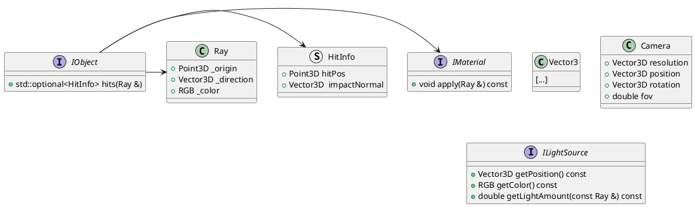

```plantuml
@startuml

class Vector3 {
    [...]
}

class Ray {
  + Point3D _origin
  + Vector3D _direction
  + RGB _color
}

class Camera {
    + Vector3D resolution
    + Vector3D position
    + Vector3D rotation
    + double fov
}

struct HitInfo {
    + Point3D hitPos
    + Vector3D  impactNormal
}

interface IObject {
  + std::optional<HitInfo> hits(Ray &)
}

interface ILightSource {
    + Vector3D getPosition() const
    + RGB getColor() const
    + double getLightAmount(const Ray &) const
}

interface IMaterial {
    + void apply(Ray &) const
}

IObject -> IMaterial
IObject -> HitInfo
IObject -> Ray
@enduml
```
