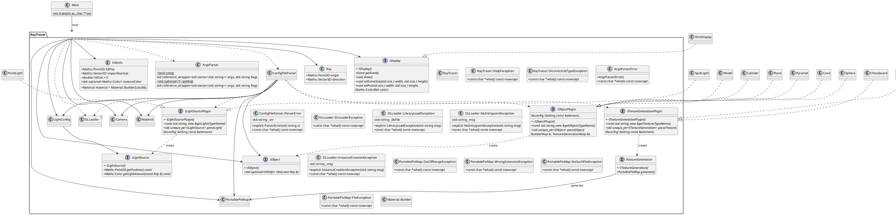
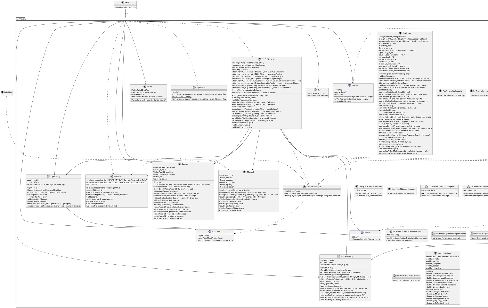

```plantuml
@startuml
skinparam classAttributeIconSize 0
skinparam componentStyle rectangle

namespace RayTracer {
  class RayTracer {
  }

  class RayTracer::HelpException {
    +const char *what() const noexcept
  }

  class RayTracer::IncorrectLibTypeException {
    +const char *what() const noexcept
  }

  class ArgsParserError {
    +ArgsParserError()
    +const char *what() const noexcept
  }

  class ArgsParser {
    +{static} bool isArg(
        std::reference_wrapper<std::vector<std::string>> args, std::string flag)
    +{static} std::optional<T> getArg(
        std::reference_wrapper<std::vector<std::string>> args, std::string flag)
  }

  class ConfigFileParser {
  }

  class ConfigFileParser::ParserError {
    +explicit ParserError(std::string s)
    +const char *what() const noexcept
    -std::string _err
  }

  class DLLoader<T> {
  }

  class DLLoader::DLLoaderException {
    +const char *what() const noexcept
  }

  class DLLoader::LibraryLoadException {
    +explicit LibraryLoadException(std::string msg)
    +const char *what() const noexcept
    -std::string _libFile
  }

  class DLLoader::NoEntrypointException {
    +explicit NoEntrypointException(std::string msg)
    +const char *what() const noexcept
    -std::string _msg
  }

  class DLLoader::InstanceCreationException {
    +explicit InstanceCreationException(std::string msg)
    +const char *what() const noexcept
    -std::string _msg
  }

  class PortablePixMap {
  }

  class PortablePixMap::OutOfRangeException {
    +const char *what() const noexcept
  }

  class PortablePixMap::WrongExtensionException {
    +const char *what() const noexcept
  }

  class PortablePixMap::NoSuchFileException {
    +const char *what() const noexcept
  }

  class PortablePixMap::FileException {
    +const char *what() const noexcept
  }

  class Camera {
  }

  class Ray {
    +Maths::Point3D origin
    +Maths::Vector3D direction
  }

  class Material {
  }

  class Material::Builder {
  }

  class LightConfig {
  }

  class HitInfo {
    +Maths::Point3D hitPos
    +Maths::Vector3D impactNormal
    +double hitDist = 0
    +Material material = Material::Builder().build()
    +std::optional<Maths::Color> textureColor
  }

  interface IObject {
    +{abstract} ~IObject()
    +{abstract} std::optional<HitInfo> hits(const Ray &)
  }

  interface ILightSource {
    +{abstract} ~ILightSource()
    +{abstract} Maths::Point3D getPosition() const
    +{abstract} Maths::Color getLightAmount(const Ray &) const
  }

  interface ITextureGeneration {
    +{abstract} ~ITextureGeneration()
    +{abstract} PortablePixMap generate()
  }

  interface IDisplay {
    +{abstract} ~IDisplay()
    +{abstract} Event getEvent()
    +{abstract} void draw()
    +{abstract} void setSceneSize(std::size_t width, std::size_t height)
    +{abstract} void setPix(std::size_t width, std::size_t height,
        Maths::Color8bit color)
  }

  interface IObjectPlugin {
    +{abstract} ~IObjectPlugin()
    +{abstract} const std::string_view &getObjectsTypeName()
    +{abstract} std::unique_ptr<IObject> parseObject(
        libconfig::Setting const &element,
        BuilderMap &, TextureGenerationMap &)
  }

  interface ILightSourcePlugin {
    +{abstract} ~ILightSourcePlugin()
    +{abstract} const std::string_view &getLightsTypeName()
    +{abstract} std::unique_ptr<ILightSource> parseLight(
        libconfig::Setting const &element)
  }

  interface ITextureGenerationPlugin {
    +{abstract} ~ITextureGenerationPlugin()
    +{abstract} const std::string_view &getTexturesTypeName()
    +{abstract} std::unique_ptr<ITextureGeneration> parseTexture(
        libconfig::Setting const &element)
  }
}

class Main {
  +{static} int main(int ac, char **av)
}


Main --> RayTracer : run()
RayTracer ..> ArgsParser
RayTracer ..> ConfigFileParser
RayTracer ..> DLLoader
RayTracer --> IDisplay
RayTracer --> PortablePixMap
RayTracer --> Camera
RayTracer --> LightConfig
RayTracer --> IObject
RayTracer --> Ray
RayTracer --> HitInfo
RayTracer --> Material

ConfigFileParser ..> DLLoader
ConfigFileParser --> Camera
ConfigFileParser --> LightConfig
ConfigFileParser --> IObject
ConfigFileParser --> Material
ConfigFileParser --> PortablePixMap
ConfigFileParser ..> IObjectPlugin
ConfigFileParser ..> ILightSourcePlugin
ConfigFileParser ..> ITextureGenerationPlugin

IObjectPlugin ..> IObject : create
ILightSourcePlugin ..> ILightSource : create
ITextureGenerationPlugin ..> ITextureGeneration : create
ITextureGeneration --> PortablePixMap : generate
LightConfig --> ILightSource

SfmlDisplay ..|> IDisplay
PointLight ..|> ILightSourcePlugin
SpotLight ..|> ILightSourcePlugin
Sphere ..|> IObjectPlugin
Plane ..|> IObjectPlugin
Cylinder ..|> IObjectPlugin
Cone ..|> IObjectPlugin
Pyramid ..|> IObjectPlugin
Model ..|> IObjectPlugin
Chessboard ..|> ITextureGenerationPlugin
PerlinNoise ..|> ITextureGenerationPlugin

@enduml
```

```plantuml
@startuml
skinparam classAttributeIconSize 0
skinparam componentStyle rectangle

namespace RayTracer {
  class RayTracer {
    +RayTracer(std::vector<std::string> args)
    +void run() noexcept
    +void throwRays(std::size_t scale, std::size_t maxDepth) noexcept
    +Maths::Color lunchRays(Maths::Vector2U idx, Maths::Vector2U res,
        std::size_t scale, std::size_t maxDepth)
    +void rayWorker(Maths::Vector2U start, Maths::Vector2U end,
        Maths::Vector2U res, std::size_t scale, std::size_t maxDepth)
    +{static} void showHelp()
    -void cancelAndJoin(std::thread &thread)
    -std::thread startRender(std::size_t scale, std::size_t maxDepth)
    -void updateRays(Maths::Vector2U start,
        Maths::Vector2U end, std::vector<Maths::Color> update)
    -void rayWorkerBatch(std::size_t scale, std::size_t x, std::size_t y,
        std::vector<Maths::Color> &update, Maths::Color color)
    -void throwDisplay()
    -void updateDisplayColor(std::size_t i, std::size_t j,
        Maths::Color8bit color)
    -bool moveCamera(Action action)
    -bool rotateCamera(Action action)
    -int handleEvent(Event event, Clock::time_point &clock, bool &sleep,
        bool &lowQuality, std::thread &thread)
    -void updateCamera(Clock::time_point &clock, bool &sleep,
        bool &lowQuality, std::thread &thread)
    -void parseOptionalArgs(std::vector<std::string> args)
    -void initVars(std::reference_wrapper<std::vector<std::string>> args)
    -Maths::Color hitColor(const Ray &ray, HitInfo &info,
        std::size_t depth, int maxDepth)
    -std::optional<HitInfo> getHitObject(Ray const &ray, bool nearest)
    -double getSpecular(const Ray &ray,
        const Ray &lightRay, HitInfo &info)
    -Maths::Color parseObject(const Ray &ray,
        std::size_t depth, int maxDepth)
    -Maths::Color parseLight(const Ray &ray, HitInfo &info)
    -void updateLoadingBar()
    -void makeWorker(Maths::Vector2U resolution, std::size_t scale,
        std::size_t maxDepth, double stepX, double stepY)
    -ConfigFileParser _configFileParser
    -std::optional<DLLoader<IDisplay>> _displayLoader = std::nullopt
    -std::optional<std::unique_ptr<IDisplay>> _display = std::nullopt
    -PortablePixMap _ppm
    -std::string _name
    -Camera _camera
    -std::vector<std::unique_ptr<IObject>> _objects
    -LightConfig _lights
    -double _loadingPercentage = 0.0
    -int _maxDepth = 10
    -int _nbScreenSplit = 4
    -std::mutex _mutex
    -std::size_t _anti_aliasing = 0
    -std::vector<std::thread> _workers
    -std::atomic<bool> _renderDone = false
    -std::atomic<bool> _cancelRender = false
  }

  class RayTracer::HelpException {
    +const char *what() const noexcept
  }

  class RayTracer::IncorrectLibTypeException {
    +const char *what() const noexcept
  }

  class ArgsParserError {
    +ArgsParserError()
    +const char *what() const noexcept
  }

  class ArgsParser {
    +{static} bool isArg(
        std::reference_wrapper<std::vector<std::string>> args, std::string flag)
    +{static} std::optional<T> getArg(
        std::reference_wrapper<std::vector<std::string>> args, std::string flag)
  }

  class ConfigFileParser {
    +ConfigFileParser(std::vector<std::string> &args)
    +Camera parseCamera() const
    +LightConfig parseLights() const
    +void parseMaterials(libconfig::Setting const &element)
    +void parseTextures(libconfig::Setting const &element)
    +void parseSimilarTexture(
        libconfig::Setting const &texturesSetting,
        std::unique_ptr<ITextureGenerationPlugin> const &plugin)
    +std::vector<std::unique_ptr<IObject>> parsePrimitives() const
    +{static} std::vector<std::unique_ptr<ILightSource>>
        parseSimilarLight(libconfig::Setting const &lightsSetting,
            std::unique_ptr<ILightSourcePlugin> const &plugin)
    +std::vector<std::unique_ptr<IObject>>
        parseSimilarPrimitives(libconfig::Setting const &element,
            std::unique_ptr<IObjectPlugin> const &plugins) const
    -void loadPrimitivePlugins()
    -void loadLightPlugins()
    -void loadTexturePlugins()
    -std::string _filepath
    -std::vector<DLLoader<IObjectPlugin>> _primitivesPluginsLoaders
    -std::vector<std::unique_ptr<IObjectPlugin>> _primitivesPlugins
    -std::vector<DLLoader<ILightSourcePlugin>> _lightsPluginsLoaders
    -std::vector<std::unique_ptr<ILightSourcePlugin>> _lightsPlugins
    -std::vector<DLLoader<ITextureGenerationPlugin>> _texturesGenerationPluginsLoaders
    -std::vector<std::unique_ptr<ITextureGenerationPlugin>> _texturesGenerationPlugins
    -std::unordered_map<std::string, Material::Builder> _materialBuilders
    -std::unordered_map<std::string, PortablePixMap> _textureGenerationMap
    -{static} BuilderMap _presetMaterialBuilders
    -{static} constexpr std::string_view PLUGINS_FOLDER = "plugins"
  }

  class ConfigFileParser::ParserError {
    +explicit ParserError(std::string s)
    +const char *what() const noexcept
    -std::string _err
  }

  class DLLoader<T> {
    +explicit DLLoader(const std::string &libFile)
    +explicit DLLoader()
    +DLLoader(DLLoader &&other) noexcept
    +DLLoader &operator=(DLLoader &&other) noexcept
    +~DLLoader()
    +std::unique_ptr<T> getInstance()
    +LibType getType() const
    +void close() noexcept
    +void loadFile(const std::string &libFile)
    -{static} constexpr std::string_view ENTRY_POINT_SYMBOL = "rayTracerLibEntryPoint"
    -{static} constexpr std::string_view TYPE_ENTRY_POINT_SYMBOL = "rayTracerType"
    -void *_handle
  }

  class DLLoader::DLLoaderException {
    +const char *what() const noexcept
  }

  class DLLoader::LibraryLoadException {
    +explicit LibraryLoadException(std::string msg)
    +const char *what() const noexcept
    -std::string _libFile
  }

  class DLLoader::NoEntrypointException {
    +explicit NoEntrypointException(std::string msg)
    +const char *what() const noexcept
    -std::string _msg
  }

  class DLLoader::InstanceCreationException {
    +explicit InstanceCreationException(std::string msg)
    +const char *what() const noexcept
    -std::string _msg
  }

  class PortablePixMap {
    +PortablePixMap()
    +PortablePixMap(Maths::Vector2U vec)
    +PortablePixMap(std::size_t width, std::size_t height)
    +PortablePixMap(std::string filepath)
    +void setPix(std::size_t width, std::size_t height, Maths::Color pix)
    +Maths::Color getPix(std::size_t width, std::size_t height) const
    +size_t getHeight() const
    +size_t getWidth() const
    +void save(std::string name)
    -bool customGetline(std::reference_wrapper<std::string> str,
        std::reference_wrapper<std::ifstream> file)
    -bool readType(std::reference_wrapper<std::ifstream> file)
    -bool readSize(std::reference_wrapper<std::ifstream> file)
    -bool readMaxSize(std::reference_wrapper<std::ifstream> file)
    -bool readBody(std::istringstream &line)
    -std::size_t _width
    -std::size_t _height
    -std::vector<Maths::Color> _map = {}
  }

  class PortablePixMap::OutOfRangeException {
    +const char *what() const noexcept
  }

  class PortablePixMap::WrongExtensionException {
    +const char *what() const noexcept
  }

  class PortablePixMap::NoSuchFileException {
    +const char *what() const noexcept
  }

  class PortablePixMap::FileException {
    +const char *what() const noexcept
  }

  class Camera {
    +Camera()
    +Camera(Maths::Vector2U const &resolution, Maths::Point3D const &position,
        Maths::Quaternion const &rotation, double fov)
    +Ray ray(const Maths::Vector2D &v) const noexcept
    +void updateCamera() noexcept
    +void setResolution(Maths::Vector2U const &reso) noexcept
    +void setPosition(Maths::Point3D const &pos) noexcept
    +void setRotation(Maths::Quaternion const &rot) noexcept
    +void setFov(double fov) noexcept
    +double getFov() const noexcept
    +std::size_t getNbPixel() const noexcept
    +Maths::Vector2U getResolution() const noexcept
    +Maths::Point3D getPosition() const noexcept
    +Maths::Quaternion getRotation() const noexcept
    +Maths::Vector3D forward() const noexcept
    +Maths::Vector3D right() const noexcept
    +Maths::Vector3D up() const noexcept
    -Maths::Vector2U _resolution
    -std::size_t _nbPix
    -Maths::Point3D _position
    -Maths::Quaternion _rotation
    -double _fov
    -Rectangle _screen
  }

  class Ray {
    +Maths::Point3D origin
    +Maths::Vector3D direction
  }

  class Material {
    +explicit Material(Builder const &builder)
    +Ray getReflectRay(const Ray &ray, const HitInfo &hit) const
    +std::optional<Ray> getRefractRay(const Ray &ray, const HitInfo &hit) const
    +double getFresnel(const Ray &ray, const HitInfo &hit) const
    +Maths::Color getColor(const HitInfo &hit) const
    +double getSpecular() const
    +double getRoughness() const
    +double getOpacity() const
    +Maths::Color getDiffuse() const
    +double getShininess() const
    -Maths::Color _color
    -double _metallic
    -double _specular
    -double _roughness
    -double _opacity
    -double _refraction
  }

  class Material::Builder {
    +Builder()
    +Builder &color(Maths::Color color)
    +Builder &metallic(double metallic)
    +Builder &specular(double specular)
    +Builder &roughness(double roughness)
    +Builder &opacity(double opacity)
    +Builder &refraction(double refraction)
    +Builder &texture(bool texture)
    +Material build() const
    +Maths::Color getColor() const
    +double getMetallic() const
    +double getSpecular() const
    +double getRoughness() const
    +double getOpacity() const
    +double getRefraction() const
    -Maths::Color _color = Maths::Color::WHITE
    -double _metallic
    -double _specular
    -double _roughness
    -double _opacity
    -double _refraction
  }

  class LightConfig {
    +LightConfig()
    +LightConfig(double ambient, double diffuse,
        std::vector<std::unique_ptr<ILightSource>> lights)
    +double getAmbient() const
    +double getDiffuse() const
    +void setAmbient(double)
    +void setDiffuse(double)
    +std::vector<std::unique_ptr<ILightSource>> &getLights()
    +const std::vector<std::unique_ptr<ILightSource>> &getLights() const
    -double _ambient
    -double _diffuse
    -std::vector<std::unique_ptr<ILightSource>> _lights
  }

  class HitInfo {
    +Maths::Point3D hitPos
    +Maths::Vector3D impactNormal
    +double hitDist = 0
    +Material material = Material::Builder().build()
    +std::optional<Maths::Color> textureColor
  }

  interface IObject {
    +{abstract} ~IObject()
    +{abstract} std::optional<HitInfo> hits(const Ray &)
  }

  interface ILightSource {
    +{abstract} ~ILightSource()
    +{abstract} Maths::Point3D getPosition() const
    +{abstract} Maths::Color getLightAmount(const Ray &) const
  }

  interface ITextureGeneration {
    +{abstract} ~ITextureGeneration()
    +{abstract} PortablePixMap generate()
  }

  interface IDisplay {
    +{abstract} ~IDisplay()
    +{abstract} Event getEvent()
    +{abstract} void draw()
    +{abstract} void setSceneSize(std::size_t width, std::size_t height)
    +{abstract} void setPix(std::size_t width, std::size_t height,
        Maths::Color8bit color)
  }

  interface IObjectPlugin {
    +{abstract} ~IObjectPlugin()
    +{abstract} const std::string_view &getObjectsTypeName()
    +{abstract} std::unique_ptr<IObject> parseObject(libconfig::Setting const &element, BuilderMap &, TextureGenerationMap &)
  }

  interface ILightSourcePlugin {
    +{abstract} ~ILightSourcePlugin()
    +{abstract} const std::string_view &getLightsTypeName()
    +{abstract} std::unique_ptr<ILightSource> parseLight(libconfig::Setting const &element)
  }

  interface ITextureGenerationPlugin {
    +{abstract} ~ITextureGenerationPlugin()
    +{abstract} const std::string_view &getTexturesTypeName()
    +{abstract} std::unique_ptr<ITextureGeneration> parseTexture(libconfig::Setting const &element)
  }
}

class Main {
  +{static} int main(int ac, char **av)
}


Main --> RayTracer : run()
RayTracer ..> ArgsParser
RayTracer ..> ConfigFileParser
RayTracer ..> DLLoader
RayTracer --> IDisplay
RayTracer --> PortablePixMap
RayTracer --> Camera
RayTracer --> LightConfig
RayTracer --> IObject
RayTracer --> Ray
RayTracer --> HitInfo
RayTracer --> Material

ConfigFileParser ..> DLLoader
ConfigFileParser --> Camera
ConfigFileParser --> LightConfig
ConfigFileParser --> IObject
ConfigFileParser --> Material
ConfigFileParser --> PortablePixMap
ConfigFileParser ..> IObjectPlugin
ConfigFileParser ..> ILightSourcePlugin
ConfigFileParser ..> ITextureGenerationPlugin

IObjectPlugin ..> IObject : create
ILightSourcePlugin ..> ILightSource : create
ITextureGenerationPlugin ..> ITextureGeneration : create
ITextureGeneration --> PortablePixMap : generate
LightConfig --> ILightSource

SfmlDisplay ..|> IDisplay
PointLight ..|> ILightSourcePlugin
SpotLight ..|> ILightSourcePlugin
Sphere ..|> IObjectPlugin
Plane ..|> IObjectPlugin
Cylinder ..|> IObjectPlugin
Cone ..|> IObjectPlugin
Pyramid ..|> IObjectPlugin
Model ..|> IObjectPlugin
Chessboard ..|> ITextureGenerationPlugin
PerlinNoise ..|> ITextureGenerationPlugin
@enduml
```