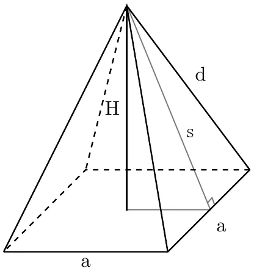

# Raytracer Plugin - Triangle (rectangle base pyramid) primitive



## How to configure

The triangle need:
 - An **origin point**: `Point3D`
 - A **height**: `double`
 - A **width**: `double`
 - A **length**: `double`
 - A **color**: `RGB`

Width and length are for the **base**. Height is the height of the apex.

## Example

```cfg
primitives:
{
    triangles = (
        { origin = { x = 60; y = 5; z = 40; }; h = 25.0; w = 42.2; l = 20.6; color = { r = 255; g = 64; b = 64; }; },
        { origin = { x = -40; y = 20; z = -10; }; h = 2.1; w = 12.0; l = 32.0; color = { r = 64; g = 255; b = 64; }; }
    );
};
```
